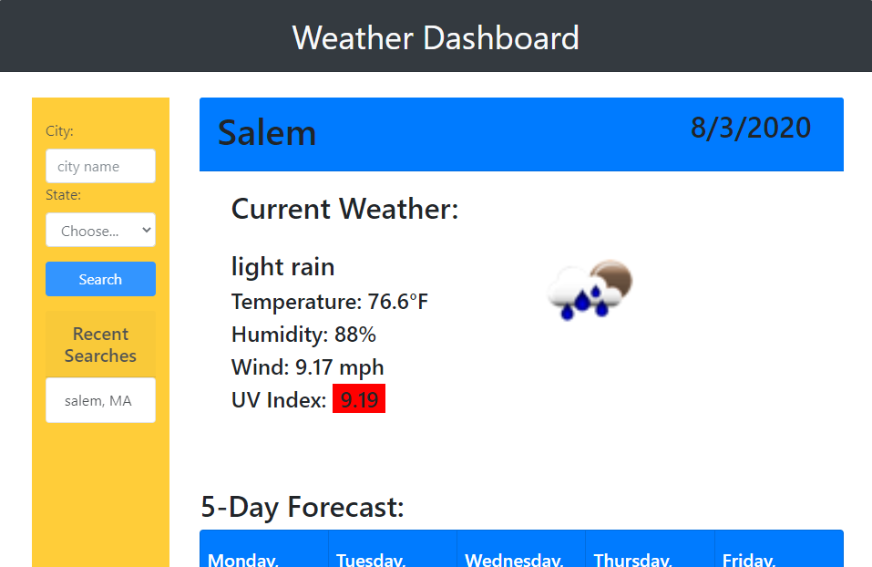
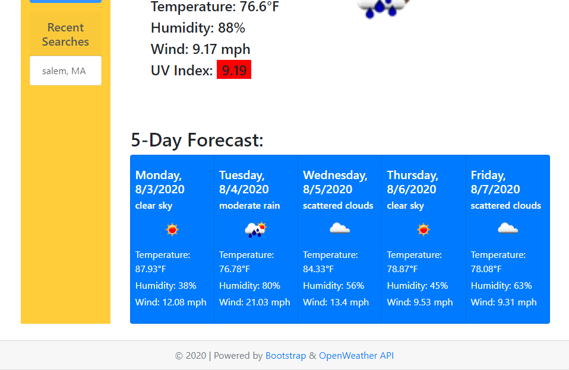

# Weather Dashboard

An app which allows the user to search for a given city and get the current weather of that city as well as a 5-day forecast.

# App Preview

### Functionality

* On first visit, page will appear with header title & search fields.

* The current weather includes a verbal description of the weather, temperature, humidity, wind, UV index, and an icon depicting the weather.

* The 5-day forecast includes the day of the week, date, verbal description of the forecasted weather, icon depicting the forecasted weather, and forecasted temperature, humidity, and wind speed.

* Last 9 searched cities appear in the left column and can be clicked on to recall. This info is retained in `searches []` on `localStorage` from one visit/refresh to the next for the user.

* Subsequent visits/refreshes to the site display the weather info of the last city viewed.

* UV Index is color-coded to reflect the severity of UV conditions. Color coding was programmed to match that of the [EPA](https://www.epa.gov/sites/production/files/documents/uviguide.pdf).

###Credits

Weather data throughout this site come from [OpenWeather API](https://openweathermap.org/api).

Styling and layout assisted by [Bootstrap](https://getbootstrap.com/).

### Deployed

* The URL of the functional, deployed application:
https://patdowner.github.io/weatherApp/

* The URL of the GitHub repository:
https://github.com/PatDowner/weatherApp.git